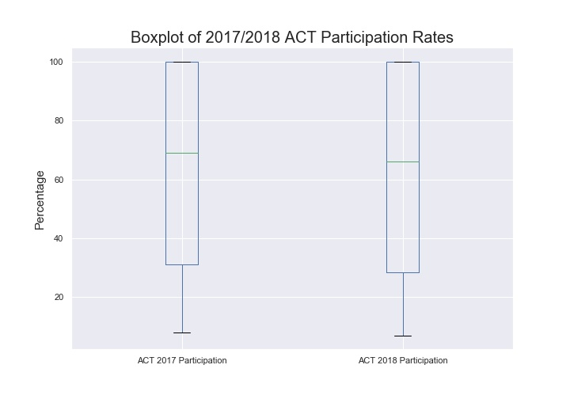
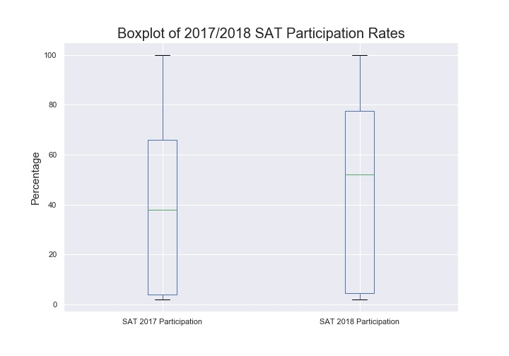
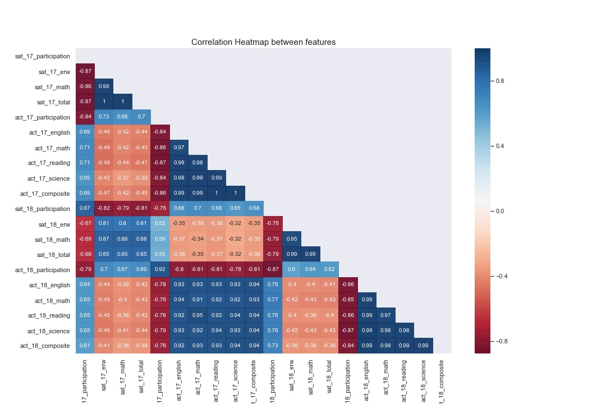
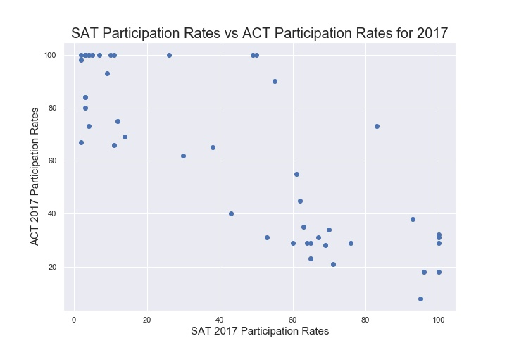
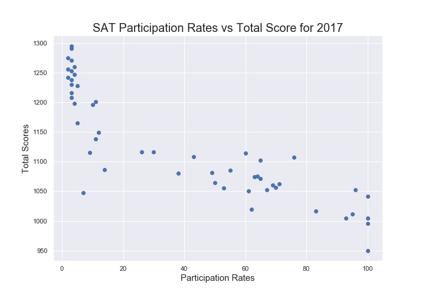
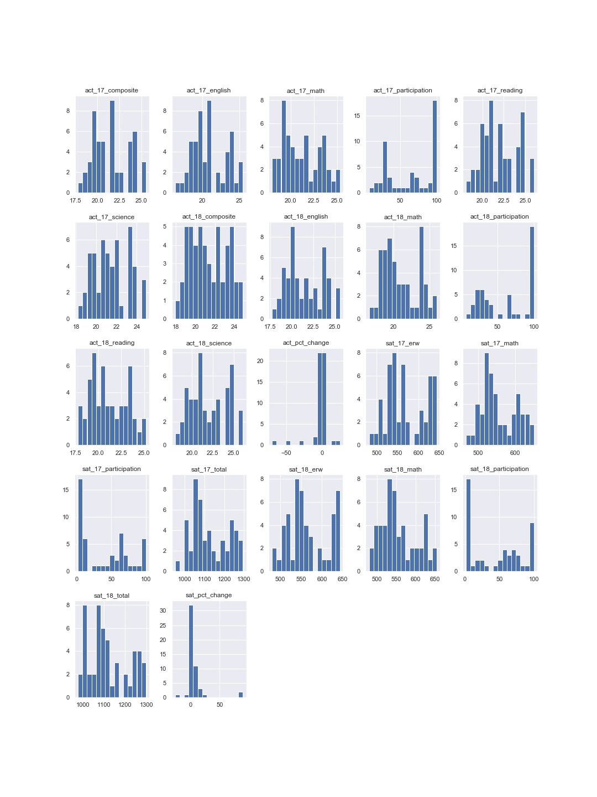

#  Project 1: Standardized Testing, Statistical Summaries and Inference

## Contents:
- [Overview](#Overview)
- [Problem Statement](#Problem-Statement)
- [Summary of Dataset](#Summary-of-Dataset)
- [Executive Summary](#Executive-Summary)
- [Conclusions and Recommendations](#Conclusions-and-Recommendations)

---
## Overview

For our first project, we're going to take a look at aggregate SAT and ACT scores and participation rates from each state in the United States. We'll seek to identify trends in the data and combine our data analysis with outside research to identify likely factors influencing participation rates and scores in various states.

---
## Problem Statement

Here's a specific prompt which we will be basing on to craft our problem statement:
> The new format for the SAT was released in March 2016. As an employee of the College Board - the organization that administers the SAT - you are a part of a team that tracks statewide participation and recommends where money is best spent to improve SAT participation rates. Your presentation and report should be geared toward **non-technical** executives with the College Board and you will use the provided data and outside research to make recommendations about how the College Board might work to increase the participation rate in a **state of your choice**.

**Problem Statement:**

Based on the dataset given, can we draw any conclusions as to how we can improve the SAT participation rates? If not, what else would we need to focus on to draw relevant insights?

---
## Summary of Dataset

**Brief description of datasets:**

The datasets we will be working with gives us the various _test scores_ and the _participation rates_ broken down by the _various US states_ by the respective years.

**Manipulation of datasets:**

There will be 2 initial sets of data: _ACT in 2017_ & _SAT in 2017_

There after we will include the respective 2018 datasets and combine them into one _overall dataset_.

Data Dictionary of the initial 2 datasets (SAT & ACT 2017):

| Feature              | Type    | Dataset   | Description                                 |
|:---------------------|:--------|:----------|:--------------------------------------------|
| state                | object  | SAT & ACT | Name of States                              |
| sat_17_participation | int64   | SAT       | SAT participation rates in 2017             |
| sat_17_erw           | int64   | SAT       | SAT Evidence-Based Reading & Writing Scores |
| sat_17_math          | int64   | SAT       | SAT Math Scores                             |
| sat_17_total         | int64   | SAT       | SAT Total Scores                            |
| act_17_participation | int64   | ACT       | ACT Participation Rates                     |
| act_17_english       | float64 | ACT       | ACT English Scores                          |
| act_17_math          | float64 | ACT       | ACT Math Scores                             |
| act_17_reading       | float64 | ACT       | ACT Reading Scores                          |
| act_17_science       | float64 | ACT       | ACT Science Scores                          |
| act_17_composite     | float64 | ACT       | ACT Composite Scores                        |

Data Dictionary of the _Overall_ dataset (SAT & ACT from 2017 to 2018):

| Feature              | Type    | Dataset         | Description                                             |
|:---------------------|:--------|:----------------|:--------------------------------------------------------|
| state                | object  | Overall SAT/ACT | Name of States                                          |
| sat_17_participation | int64   | Overall SAT/ACT | SAT participation rates in 2017                         |
| sat_17_erw           | int64   | Overall SAT/ACT | SAT Evidence-Based Reading & Writing Scores in 2017     |
| sat_17_math          | int64   | Overall SAT/ACT | SAT Math Scores in 2017                                 |
| sat_17_total         | int64   | Overall SAT/ACT | SAT Total Scores in 2017                                |
| act_17_participation | int64   | Overall SAT/ACT | ACT Participation Rates in 2017                         |
| act_17_english       | float64 | Overall SAT/ACT | ACT English Scores in 2017                              |
| act_17_math          | float64 | Overall SAT/ACT | ACT Math Scores in 2017                                 |
| act_17_reading       | float64 | Overall SAT/ACT | ACT Reading Scores in 2017                              |
| act_17_science       | float64 | Overall SAT/ACT | ACT Science Scores in 2017                              |
| act_17_composite     | float64 | Overall SAT/ACT | ACT Composite Scores in 2017                            |
| sat_18_participation | int64   | Overall SAT/ACT | SAT participation rates in 2018                         |
| sat_18_erw           | int64   | Overall SAT/ACT | SAT Evidence-Based Reading & Writing Scores in 2018     |
| sat_18_math          | int64   | Overall SAT/ACT | SAT Math Scores in 2018                                 |
| sat_18_total         | int64   | Overall SAT/ACT | SAT Total Scores in 2018                                |
| act_18_participation | int64   | Overall SAT/ACT | ACT Participation Rates in 2018                         |
| act_18_english       | float64 | Overall SAT/ACT | ACT English Scores in 2018                              |
| act_18_math          | float64 | Overall SAT/ACT | ACT Math Scores in 2018                                 |
| act_18_reading       | float64 | Overall SAT/ACT | ACT Reading Scores in 2018                              |
| act_18_science       | float64 | Overall SAT/ACT | ACT Science Scores in 2018                              |
| act_18_composite     | float64 | Overall SAT/ACT | ACT Composite Scores in 2018                            |
| sat_pct_change       | int64   | Overall SAT/ACT | SAT Participation Rate percentage change over 2017/2018 |
| act_pct_change       | int64   | Overall SAT/ACT | ACT Participation Rate percentage change over 2017/2018 |

---
## Executive Summary
### 1. General Trend

Generally across 2017 to 2018, there seem to be a general increase in median participation rate for SAT & a corresponding decrease for ACT

### 2. Feature Correlation

_Plotting scatter plots of some examples:_

**From the correlation analysis, we can conclude the following points:**

- Within SAT & ACT, scores are positively correlated to each other
- Participation for SAT is correlated to the scores of ACT, vice versa
- Participation rates are inversely correlated to their own scores

**Comments:**

**Scores vs Participation Rates:**
The scores of the individual tests, tho seemingly having a correlation with the participation rates (in this dataset), is not sufficient to conclude a concrete pattern.

Based on the data exploration, the scores of the individual tests seem to be inversely correlated to the participation rates. However on further research, we do realize that for alot of cases where there are high participation rates, it is usually due to either a state ruling on compulsory taking of the exam or state funded exams. This could very well lead to the lowering of the average scores based on the simple logic that student (weak or strong) is 'forced' or given a free chance to take the exams regardless of whether they are ready for it or not. Whereas if the exams were not compulsory or free, a student might not take it if he or she is not ready.

**Participation Rates between ACT & SAT:**
Participation rates between the 2 tests seem to be inversely correlated. Which makes sense considering that they are competitors by nature (majority of students do not take both the tests)

### 3. Distribution of Various Features

Other than the % change of participation rates and the actual participation rates for SAT & ACT, other variables seem to fit a bimodal distribution.

**Participation rates:**
- generally has 2 groups: a group with high participation rates (approx 70 - 100%); & another group with generally lower participation rates (approx below 40%)

**Reading, Math (or anything that is score related):**
- Also observed to be in 2 groups: the group with generally higher scores (the stronger students) & another group with generally lower scores (the weaker students)

**General Comments:**

Because of the bimodal distribution, regression for estimates should not be done on this dataset directly. Instead, it should undergo (perhaps unsupervised) clustering to split the dataset into the 2 groups before doing estimations on both of them. That would likely yield a more accurate result.

### 4. Significant Changes in Participation Rates for both SAT & ACT

.jpg)

.jpg)

**We can identify a few states of interest (namely those in color) for the reason of:**

a) Drastic positive or negative change in participation rates over 2017 & 2018

b) A drastic change negative change in one test & a drastic positive change in the other test over 2017 & 2018 (Colorado & Illinois)

**Further Research (on the reasons for highlighted changes):**

**Colorado, dropped from 100% ACT participation rate to 100% SAT participation rates**

"Colorado high school juniors will be required to take the SAT college-entrance exam instead of the ACT starting this spring, a significant change that grew out of a competitive bidding process required by hard-fought testing **_reform legislation_**."

(https://www.chalkbeat.org/posts/co/2015/12/23/goodbye-act-hello-sat-a-significant-change-for-colorado-high-schoolers/)

**Illinois, dropped ACT participation rate & jumped in SAT participation rates**

"It's official, according to the state: Testing giant ACT is out and the College Board's SAT is in, bringing a new college entrance exam into Illinois public high schools."

"ISBE officials said the state-funded SAT is supposed to be given this school year — free of charge to high school juniors — though there are complications because of the state's budget standoff and other issues."

"In the summer of 2015, a new law took effect that required a college entrance exam to be included in the state testing cycle. But now, that exam will be the SAT, which will get a big boost in test participation under the College Board's new contract with Illinois."

(https://www.chicagotribune.com/news/ct-illinois-chooses-sat-met-20160211-story.html)

**Nebraska jumped to 100% ACT**

"2018 marks Nebraska’s first year in which 100% of graduates (24,516) took the ACT as part of a statewide **_census test_**."

(http://www.act.org/content/dam/act/unsecured/documents/cccr2018/Nebraska-CCCR-2018.pdf)

**Ohio jumped to 100% ACT**

"Ohio scores are more difficult to compare because the Class of 2018 was the first where the **_state paid for all students_** to take the exam. That means thousands of non-college-bound students who were not tested in the past were tested last year."

(https://www.daytondailynews.com/news/historically-low-act-scores-red-flag-for-our-country/djfx9Urp719WyEaMfykyxL/)

**Understanding the significant changes in participation rates:**

- Generally the increase in the participation rates of a test is due to either: **_injection of state funding_** for the tests or **_introduction of a new consensus/legislation_** which required all students of the state to take the tests
- The drastic drop in the participation rates of a test is generally due to: **_preference in the use of state funding or state legislation_** for the other test

---
## Conclusions and Recommendations

### With regards to the "preference in the use of state funding or state legislation for a competitor's test",  the following quotes found online might give us insights into why the preference:

"ISBE said it weighed the attributes of both exams and decided the SAT was better aligned with standards for what students should know in Illinois." -(https://www.chicagotribune.com/news/ct-illinois-chooses-sat-met-20160211-story.html)

"Though few students have taken the SAT in the past, many Illinois parents and students are well aware of the College Board's Advanced Placement courses and exams, as well as the PSAT that can qualify students for merit scholarships." -(https://www.chicagotribune.com/news/ct-illinois-chooses-sat-met-20160211-story.html)

"ISBE officials said the state-funded SAT is supposed to be given this school year — free of charge to high school juniors — though there are complications because of the state's budget standoff and other issues." -(https://www.chicagotribune.com/news/ct-illinois-chooses-sat-met-20160211-story.html)

#### Concluding Insights:

The following factors seem to be influential to the preference for a specific test over the other:

- **Costs.** Giving discounts for loyal states might help keep them or help ease the funding concerns of states which have tight budgets. Having lower costs might also attract students from states which dictate a compulsory exit exam but do not specify which.

- **State dependent standards.** Presumingly, the standards needed for various states might vary and by taking that into account when designing the tests might help stand out to them as a preferred choice.

- **Credibility & future influence potential** of the test when being used to apply for scholarships availability of advanced placement courses & exams. The higher the credibility & influence potential and the more available options for advanced placement courses and exams, the more it will stand out as the preferred choice.

#### Limitation of study:
The dataset is too limited and we are unable to concretely visualize any trends nor draw any statistical interence using only 2 year worth of data. We need more, maybe at least >30 years worth of data before we can infer anything.

#### Recommendations:

_**Assumptions:** we are basing the recommendations purely based on the logical deduction of 2 years worth of data_

i. Generally SAT participation rates are on the rise and whatever we are doing currently (e.g. Advanced Placement courses/exams, etc) is making good impact. Continue with them.

ii. Consider giving discounted rates for the exams to further attract participation from the states and individuals

iii. Focus on tailoring the exams to fit the various state standards

iv. Conduct further studies into the following topics:

   - What are the considerations a state takes into account when deciding which test to fund or make compulsory as a legislation?
   - The same study with data from the last 30 years to help visualize trends
   - Study the impact of extra packages (i.e. Advanced Placement courses/exams) on an individual/state's decision
